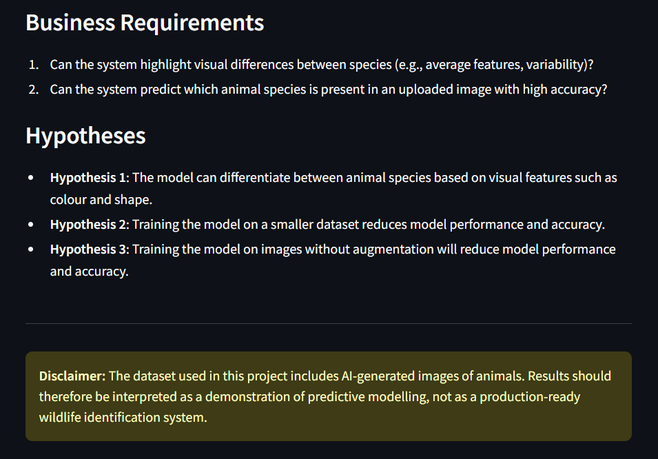
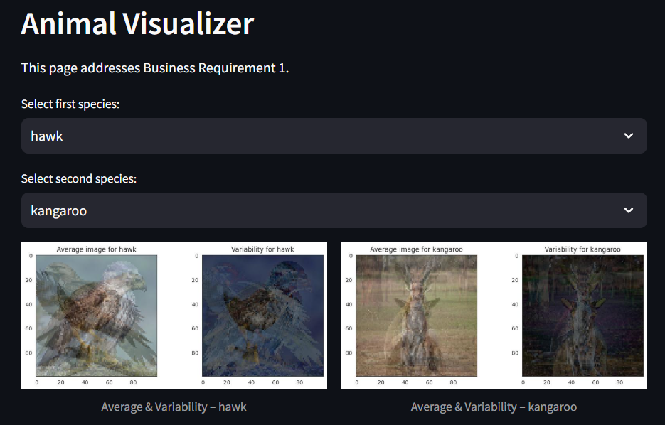
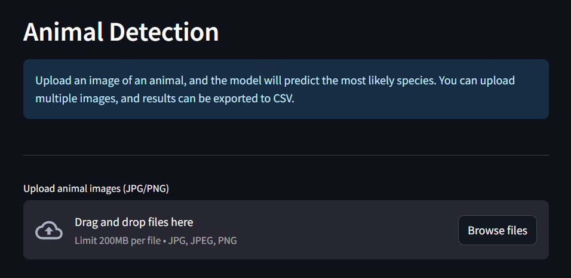
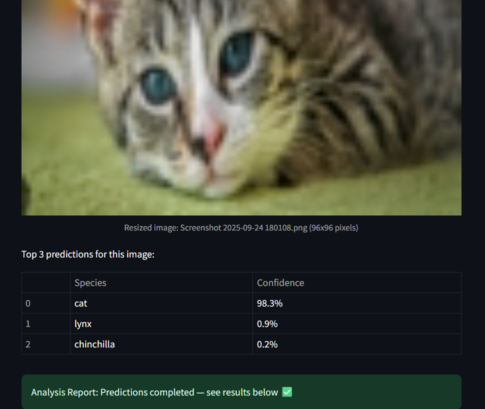
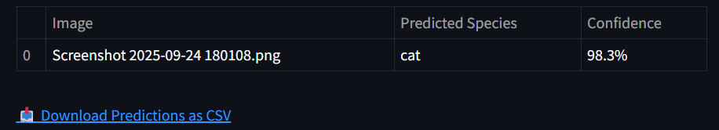
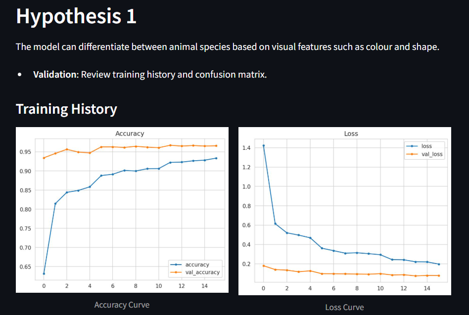
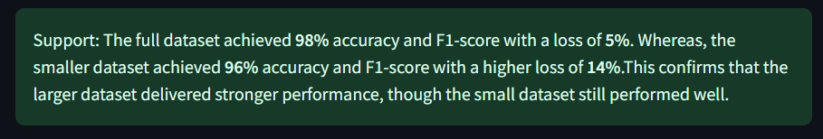
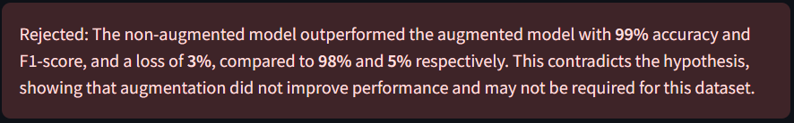
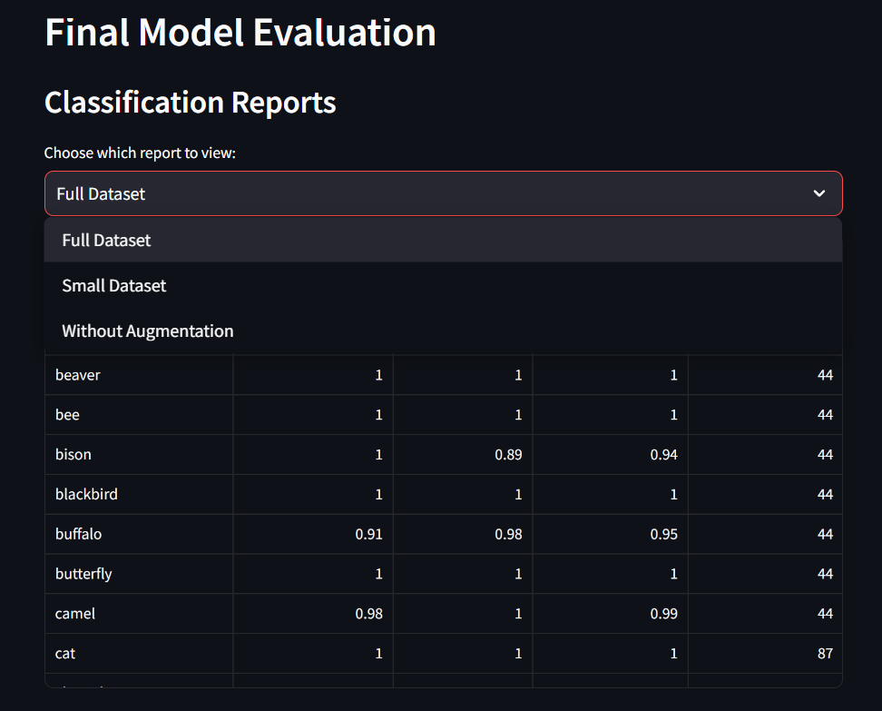

# Animal Detection Camera

## Business Requirements

The client for this project, Steve B, wants a predictive system that can accurately detect animal species from images caught on his animal trap cameras. This project thus needs multiple business requires and research needs.

- **Business requirement 1:**
  - Can the system highlight visual differences between species (e.g., average features, variability)?
- **Business requirement 2:**
  - Can the system predict which animal species is present in an uploaded image with high accuracy?

### Research Needs

- **Wildlife Monitoring & Conservation**
  - Automating identification of animals captured on the camera traps reduced manual efforts by ecologists.
  - Can enable large-scale monitoring of biodiversity and endangered species.
- **Educational Apps**
  - Provides an interactive tool (the Streamlit dashboard) for students and researchers to explore this animal image dataset.
  - Supports learning about classification models and species differences.
- **Research & Data Analysis**
  - Enables deep analysis of animal population distributions and patterns by providing reliable automated labelling.

## Dataset Content

### Data Collection

The dataset is sourced from [Kaggle](https://www.kaggle.com/datasets/anthonytherrien/image-classification-64-classes-animal). Then, a fictitious user story where predictive analytics can be applied in a real project in the workplace was created. The dataset contains over 14 thousand images  that was subdivided into 64 species, each species had their own folder.

**Steps taken:**

- Downloaded the kaggle dataset via Kaggle API (kaggle.json authentication)
- Unpacked into inputs/datasets/animals/.
- Cleaned and structured images into subfolders by species.
- Split into train, validation, and test sets using a stratified approach.

**Key Points:**

- Dataset size was large
- To save space, files were moved into split folders rather than duplicating the originals.
- Original unsplit dataset removed once splits were confirmed.

## Hypotheses

- **Hypothesis 1**: The model can differentiate between animal species based on visual features such as colour and shape.
- **Hypothesis 2**: Training the model on a smaller dataset reduces model performance and accuracy.
- **Hypothesis 3**: Training the model on images without augmentation will reduce model performance and accuracy.

## The Rationale to Map the Business Requirements to the Data Visualisations and ML Tasks

- Business requirement 1, mapped tasks:
  - Create visualizations showing average and variability images, label distribution interactive chart for train/validation/ test sets, and augmentation effects.
  - Demonstrates the dataset quality, balance, and variability.
- Business requirement 2, mapped tasks:
  - Build and train a CNN model (using MobileNetV2) to evaluate accuracy, losses, precision, recall, F1-score, and confusion matrix.
  - Demonstrate the capability of the model and validate its predictability and its usefullness.

## ML Business Case

- **Automate animal species identification from images**
Problem:
- Manually identifying animals from large datasets is time consuming.
- Prone to human errors.
Solution:
- A deep learning model trained on many animal species to determine unseen images, accurately.
Advantages:
- Fast and reliable animal identification
- Supports conservation efforts and wildlife monitoring by reducing manual workload.
- Element of scalability as new species can be added to the model's training.

## Dashboard Design

| Page | Features | Image |
| --- | --- | --- |
| All pages | Navigation bar |  |
| Project Summary | Overview of objectives and business requirements. Dataset sources and workflow. |  |
| Animal Visualizer | Average and variability plots. Select species to compare. Preview small montage from datasets. All dropdown and checkboxes. |   |
| Animal Detection | Upload image functionality. Display predicted species & confidence scores. Download the results. |    |
| Hypotheses and Validation | Display training accuracy and losses. Confusion matrix (true vs predicted species.) |     |
| ML Prediction Metrics | Label frequency in each split set. Training history from all sets. Classification reports in dropdown box. Confusion matrices highlighting misclassified species. |  |

---

delete stuff below when finished:

- List all dashboard pages and their content, either blocks of information or widgets, like buttons, checkboxes, images, or any other items, that your dashboard library supports.
- Finally, during the project development, you may revisit your dashboard plan to update a given feature (for example, at the beginning of the project, you were confident you would use a given plot to display an insight, but later, you chose another plot type).

## Unfixed Bugs

- You will need to mention unfixed bugs and why they were unfixed. This section should include shortcomings of the frameworks or technologies used. Although time can be a significant variable for consideration, paucity of time and difficulty understanding implementation is not a valid reason to leave bugs unfixed.

## Deployment

### Heroku

- The App live link is: `https://YOUR_APP_NAME.herokuapp.com/`
- Set the runtime.txt Python version to a [Heroku-20](https://devcenter.heroku.com/articles/python-support#supported-runtimes) stack currently supported version.
- The project was deployed to Heroku using the following steps.

1. Log in to Heroku and create an App
2. At the Deploy tab, select GitHub as the deployment method.
3. Select your repository name and click Search. Once it is found, click Connect.
4. Select the branch you want to deploy, then click Deploy Branch.
5. The deployment process should happen smoothly if all deployment files are fully functional. Click the button Open App on the top of the page to access your App.
6. If the slug size is too large, then add large files not required for the app to the .slugignore file.

## Main Data Analysis and Machine Learning Libraries

- Here, you should list the libraries used in the project and provide an example(s) of how you used these libraries.

## Credits

- In this section, you need to reference where you got your content, media and from where you got extra help. It is common practice to use code from other repositories and tutorials. However, it is necessary to be very specific about these sources to avoid plagiarism.
- You can break the credits section up into Content and Media, depending on what you have included in your project.

### Content

- The text for the Home page was taken from Wikipedia Article A.
- Instructions on how to implement form validation on the Sign-Up page were taken from [Specific YouTube Tutorial](https://www.youtube.com/).
- The icons in the footer were taken from [Font Awesome](https://fontawesome.com/).

### Media

Example image from Google Images:

## Acknowledgements (optional)

- Thank the people who provided support throughout this project.
