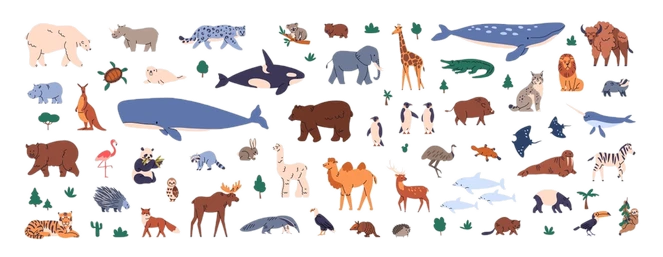
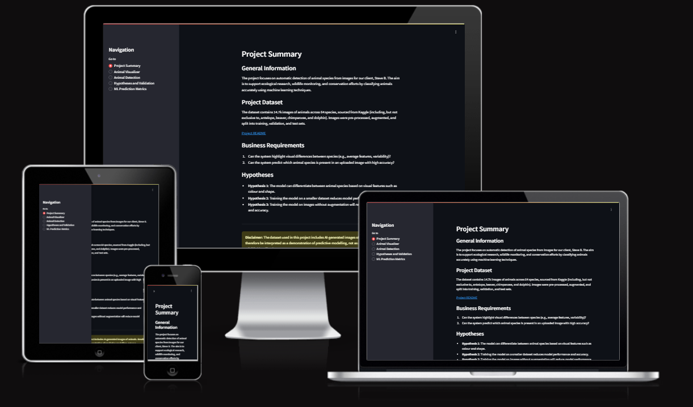
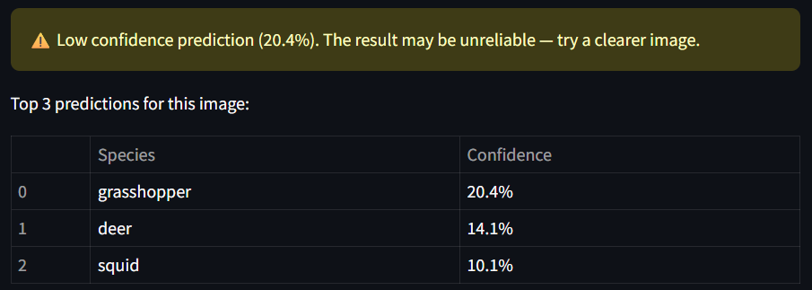
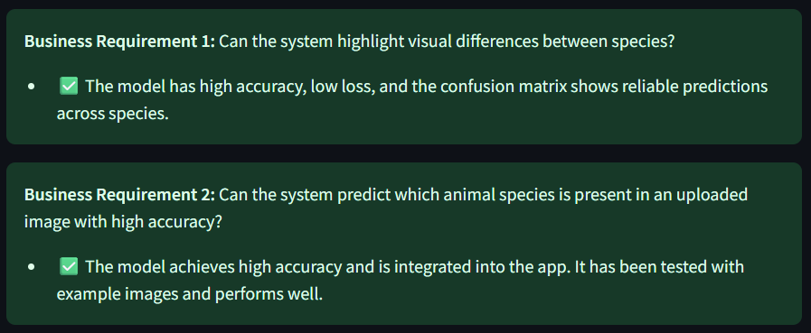

# Animal Detection Camera

View the live website: [Animal Detection Camera](https://animal-detection-camera-8ccd612a173b.herokuapp.com/)

## The Client

Our client, Steve B, is a wildlife and conservation enthusiast who want an automated way of monitoring wildlife across the world. He wants to do this by adding an automated predictive software to animal trap cameras that will be left in rural areas to film any wildlife that passes by. This would reduce the manual workload of having to go throught the footage by hand.

### User Stories

#### User Story 1: Dataset Exploration

- As a user, I want to explore species-dependent patterns from images, so that I can verify the quality of the dataset.

Acceptance Criteria:

- Dashboard page shows average and variability of images across species.
- Label distribution across train/ validation/ test sets.
- Ability to select species for direct comparisons.

#### User Story 2: Automated Animal Detection

- As a user, I want to upload an image and receive a reliable prediction with a confidence score.
  
Acceptance Criteria:

- Upload widget that allows user to use their own images.
- Model top 3 predictions displayed with confidence scores.
- Predictions validated against test set accuracy.

#### User Story 3: Model Performance Validation

- As a user, I want to review performance metrics of the ML model.

Acceptance Criteria:

- Accuracy and loss curves are displayed clearly.
- Confusion matrices to highlight misclassifications.
- Classification reports with precision, recall, and F1-score are visible.
- Support or Rejected messages for each hypothesis are clear.

#### User Story 4: Educational Exploration

- As a student/user, I want to interact with the results on the dashboard so that I can understand how CNN models classify images and see the impact of dataset size and image augmentation.

Acceptance Criteria:

- Pages include text that explains what the plots show.
- Direct comparisons between full, small, and non-augmented datasets.

## Business Requirements

Steve B, wants a predictive system that can accurately detect animal species from images caught on his animal trap cameras. This project thus needs multiple business requires and research needs.

- **Business requirement 1:**
  - Can the system highlight visual differences between species (e.g., average features, variability)?
- **Business requirement 2:**
  - Can the system predict which animal species is present in an uploaded image with high accuracy?

### Research Needs

- **Wildlife Monitoring & Conservation**
  - Automating identification of animals captured on the camera traps reduced manual efforts by ecologists.
  - Can enable large-scale monitoring of biodiversity and endangered species.
- **Educational Apps**
  - Provides an interactive tool (the Streamlit dashboard) for students and researchers to explore this animal image dataset.
  - Supports learning about classification models and species differences.
- **Research & Data Analysis**
  - Enables deep analysis of animal population distributions and patterns by providing reliable automated labelling.

## Dataset Content

### Data Collection

The dataset is sourced from [Kaggle](https://www.kaggle.com/datasets/anthonytherrien/image-classification-64-classes-animal). Then, a fictitious user story where predictive analytics can be applied in a real project in the workplace was created. The dataset contains over 14 thousand images  that was subdivided into 64 species, each species had their own folder.

**Steps taken:**

- Downloaded the kaggle dataset via Kaggle API (kaggle.json authentication)
- Unpacked into inputs/datasets/animals/.
- Cleaned and structured images into subfolders by species.
- Split into train, validation, and test sets using a stratified approach.

**Key Points:**

- Dataset size was large
- To save space, files were moved into split folders rather than duplicating the originals.
- Original unsplit dataset removed once splits were confirmed.

## Hypotheses

- **Hypothesis 1**: The model can differentiate between animal species based on visual features such as colour and shape.
- **Hypothesis 2**: Training the model on a smaller dataset reduces model performance and accuracy.
- **Hypothesis 3**: Training the model on images without augmentation will reduce model performance and accuracy.

### Hypotheses Validation

- **Hypothesis 1** was validated by producing average and variability images, accuracy and loss, curves, and a confusion matrix to confirm the model's reliability, differentiating species by visual features.
- **Hypothesis 2** was validated using the same method as hypothesis 1 but reducing the number of training images to 10% of the original split dataset.
- **Hypothesis 3** was validated using the same method as hypothesis 1 but this time the process of image augmentation was cropped out.

### Outcomes

| **Hypothesis** | **Supported or Rejected** | **Validation** |
|---|---|---|
|**Hypothesis 1**|Supported|The model can distinguish between species with high validation accuracy around 0.98 and low loss, indicating a strong performance. The confusion matrix also shows the model rarely misclassified species.|
|**Hypothesis 2**|Supported|The full dataset achieved 98% accuracy and F1-score with a loss of 5%. Whereas, the smaller dataset achieved 96% accuracy and F1-score with a higher loss of 14%.This confirms that the larger dataset delivered stronger performance, though the small dataset still performed well.|
|**Hypothesis 3**|Rejected|The non-augmented model outperformed the augmented model with 99% accuracy and F1-score, and a loss of 3%, compared to 98% and 5% respectively. This contradicts the hypothesis, showing that augmentation did not improve performance and may not be required for this dataset.|

### Insights

This hypotheses testing is aligned with the evalutaion phase of **CRIPS-DM**, as assumptions were tested against model performance. The rejection of hypothesis 3 shows how important testing is as it suggested that augmentation may not have been required due to the large and diverse range of the training dataset.

## The Rationale to Map the Business Requirements to the Data Visualisations and ML Tasks

- Business requirement 1, mapped tasks:
  - Create visualizations showing average and variability images, label distribution interactive chart for train/validation/ test sets, and augmentation effects.
  - Demonstrates the dataset quality, balance, and variability.
- Business requirement 2, mapped tasks:
  - Build and train a CNN model (using MobileNetV2) to evaluate accuracy, losses, precision, recall, F1-score, and confusion matrix.
  - Demonstrate the capability of the model and validate its predictability and its usefullness.

## ML Business Case

- **Automate animal species identification from images**
Problem:
- Manually identifying animals from large datasets is time consuming.
- Prone to human errors.
Solution:
- A deep learning model trained on many animal species to determine unseen images, accurately.
Advantages:
- Fast and reliable animal identification
- Supports conservation efforts and wildlife monitoring by reducing manual workload.
- Element of scalability as new species can be added to the model's training.

### Model Tuning and Training Strategies

- Very first CNN was a custom design that did not work accurately and had high loss.
- Imported MobileNetV2 for improved efficiency as MobileNetV2 is lightweight and the model comes with pre-trained on ImageNet.
  - Transfer low-level features such as textures and edges.
  - This CNN has scope for scalability as this pipeline could be adapted to other wildlife datasets.
- CNN Architecture consists of base convolution layers that are frozen, keeping the pre-trained features, and new dense layers were added.
  - The dense layers consisted of Global Average Pooling, Dense 256 ReLu, Dropout 0.5, and Softmax Classifier.

- Early stopping was introduced to monitor validation loss and restored best weights if there were no more improvements being made.
  - Prevents overfitting.
- Reduced Learning Rate On Plateau reduced the learning rate when validation loss plateaued. This reduced the size of the steps which fine tunes the weights.
- Model Checkpoint saved the best weights whilst training.

## Dashboard Design

| Page | Features | Image |
| --- | --- | --- |
| All pages | Navigation bar |  |
| Project Summary | Overview of objectives and business requirements. Dataset sources and workflow. |  |
| Animal Visualizer | Average and variability plots. Select species to compare. Preview small montage from datasets. All dropdown and checkboxes. |   |
| Animal Detection | Upload image functionality. Display predicted species & confidence scores. Download the results. Error message on prediction <50% |     |
| Hypotheses and Validation | Display training accuracy and losses. Confusion matrix (true vs predicted species.) |     |
| ML Prediction Metrics | Label frequency in each split set. Training history from all sets. Confusion matrices highlighting misclassified species. Classification reports in dropdown box. Business Requirements checklist. |   |

## Deployment

### Heroku

- The App live link is: [Animal Detection Camera](https://animal-detection-camera-8ccd612a173b.herokuapp.com/)
- Set the .python-version to a [Heroku-20](https://devcenter.heroku.com/articles/python-support#supported-runtimes) stack currently supported version.
- The project was deployed to Heroku using the following steps.

1. Log in to Heroku and create an App
2. At the Deploy tab, select GitHub as the deployment method.
3. Select the repository name and click Search, then click Connect.
4. Select the branch you want to deploy, then click Deploy Branch.
5. Wait for the build process to be complete. If all deployment files (Procfile, requirements.txt, setup.sh, .python-version) were correct, the deployment finished without errors.
6. If the slug size is too large (>500MB), unnecessary and large files were excluded by adding them to the .slugignore file.

### Issues Faced

- Slug size too large. First attempt at deployment failed as file was ~840MB.
  - Excluding unnecessary files for deployment such as jupyter notebooks.
  - Used tensorflow 2.20.0 in production, but changed to tensorflow-cpu 2.16.1 for deployment as tensorflow was massive.
    - This change cut hundreds of MB on its own.
  - Reduced the number of images available for selection by the user.
    - I also converted them from .png to .jpg to reduce file size.
  - The final model was saved as a keras file, I then changed it to a h5, but had to further reduce file size to a tflite format.
    - This is because keras is the heaviest format.
  - Removed interactive plot that used Plotly as I was desperate to get the slug under 500MB.
    - All of the above reduced the slug size, but it was still just over 500MB, so I had to sacrifice Plotly.

- Kernel crashes in Jupyter notebooks due to large model training runs
  - Reduced batch size.
  - Reduce the outputs

## Final Summary

Steve B was impressed by this successful project: we delivered him a predictive system that identifies 64 species of animals. With the integration of MobileNetV2 and training strategies, the model performed well on test data. The interactive Streamlit dashboard links together the business requirements and validates the hypotheses. It is user-friendly and clear so that ecologists, students, and data scientists can benefit from it.

In the future, this pipeline can be transferred to a working camera system by exporting the model into an edge device such as the Raspberry Pi connected to a trap camera. This would enable real-time predictions out in the field without requiring a constant internet connection.

## Main Data Analysis and Machine Learning Libraries

### Production Libraries

These were installed locally and used to build, analyse, and visualise the dataset and model:

|Library|What it does|
|---|---|
|streamlit==1.40.2|Dashboard framework for interactive UI|
|tensorflow==2.20.0|Deep learning framework (CNN model training)|
|pandas==2.1.1|Data manipulation and tabular handling|
|numpy==1.26.1|Numerical computing and image array processing|
|matplotlib==3.8.0|Static plotting for metrics and images|
|seaborn==0.13.2|Statistical visualisations (label distributions)|
|scikit-learn==1.3.1|Model evaluation (classification reports, confusion matrices)|
|Pillow==10.0.1|Image loading and preprocessing|
|joblib==1.4.2|Saving/loading class mappings and evaluation objects|
|kaggle==1.5.12|Kaggle API for dataset download|

### Deployment Libraries

To reduce slug size (as mentioned previously) and avoid unnecessary GPU dependencies, the following slimmed-down libraries were used in the deployed version of the app:

|Library|What it does|
|---|---|
|streamlit==1.40.2|Dashboard framework for interactive UI|
|protobuf<4|Compatibility requirement for Streamlit and TensorFlow|
|tensorflow-cpu==2.18.0|Lightweight TensorFlow build for inference only|
|pandas==2.1.1|Data manipulation and tabular handling|
|numpy==1.26.1|Numerical computing and image array processing|
|matplotlib==3.8.0|Static plotting for metrics and images|
|seaborn==0.13.2|Statistical visualisations (label distributions, heatmaps)|
|scikit-learn==1.3.1|Model evaluation (classification reports, confusion matrices)|
|Pillow==10.0.1|Image loading and preprocessing|
|joblib==1.4.2|Saving/loading class mappings and evaluation objects|

## Unfixed Bugs  

- At the time of submission, no major unfixed bugs remain.  
- Previous issues (kernel crashes and Plotly slug size) were fixed (refer to Issue Faced section above).

## Credits

- [Kaggle](https://www.kaggle.com/datasets/anthonytherrien/image-classification-64-classes-animal?select=image)
- Code Institute Course Material - Predictive Analysis:
  - For the use of Streamlit, Jupyter, and CRISP-DM Methodology.
- [TensorFlow Keras Documentation](https://www.tensorflow.org/tutorials/keras/keras_tuner)
- [TensorFlow Keras - EarlyStopping](https://www.tensorflow.org/api_docs/python/tf/keras/callbacks/EarlyStopping)
- [TensorFlow Keras - ReduceLROnPlateau](https://www.tensorflow.org/api_docs/python/tf/keras/callbacks/ReduceLROnPlateau)
- [TensorFlow Keras - ModelCheckpoint](https://www.tensorflow.org/api_docs/python/tf/keras/callbacks/ModelCheckpoint?hl=en)
- [Scikit-learn documentation](https://scikit-learn.org/0.21/tutorial/index.html)
- [Matplotlib tutorials](https://matplotlib.org/stable/tutorials/images.html#sphx-glr-tutorials-images-py)
- [Matplotlib W3schools](https://www.w3schools.com/python/matplotlib_intro.asp)
- [Seaborn](https://www.datacamp.com/tutorial/seaborn-python-tutorial)
- [TailTeller](https://github.com/Jaaz7/TailTeller) is a repository from a previous student that inspired my layout
- [Emojis](https://streamlit-emoji-shortcodes-streamlit-app-gwckff.streamlit.app/)

### Media

- All model output images were generated during this project.
- No external stock images or media were used in the deployed Streamlit dashboard.

## Acknowledgements

- Thank the people who provided support throughout this project.
